# Xian Li Low's Portfolio

 Link: https://xianlilow.netlify.com/

 GitHub Repository: https://github.com/xianll/Portfolio
 
 ## Purpose 
 To showcase my personality and skillsets to potential employers and the programming community at large. 

 ## Features
Upon loading the website, you will be brought to a landing page. On it you will be able to navigate to the About Me, Projects and Contact pages.

The Landing Page
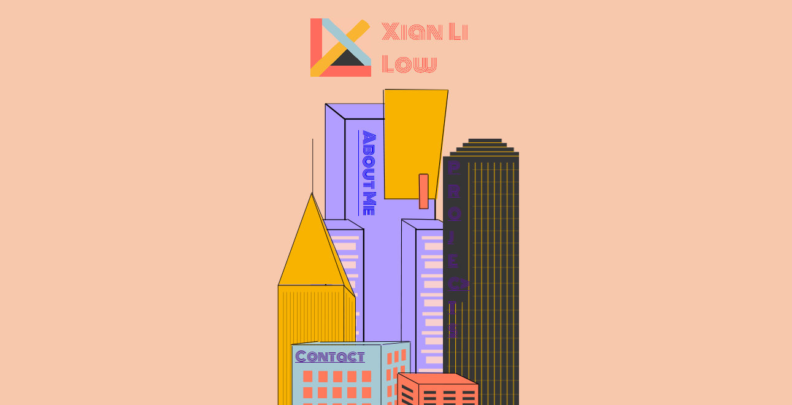

About Me Page
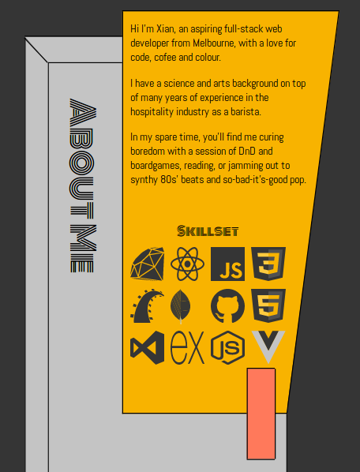

Contact Page
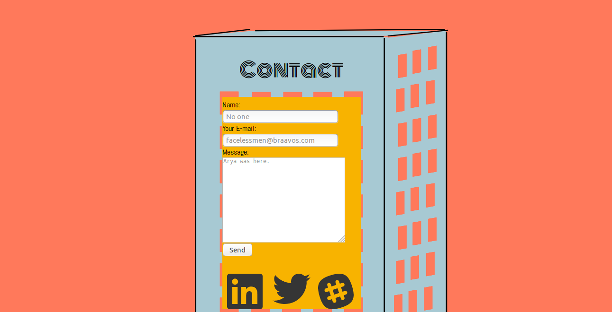

Projects Page
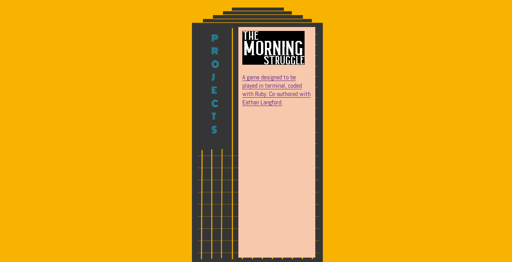

## Tech Stack
* html
* css
* GitHub
* Netlify
* Formspree
* Figma 
  

## Design
---
Firstly, I went around looking for what I thought would be aesthetically pleasing. Found that the websites I was most drawn to had pastel colour palettes. I created a colour palette by borrowing from the following websites. 

Beyond Beauty

Innovation is Hard
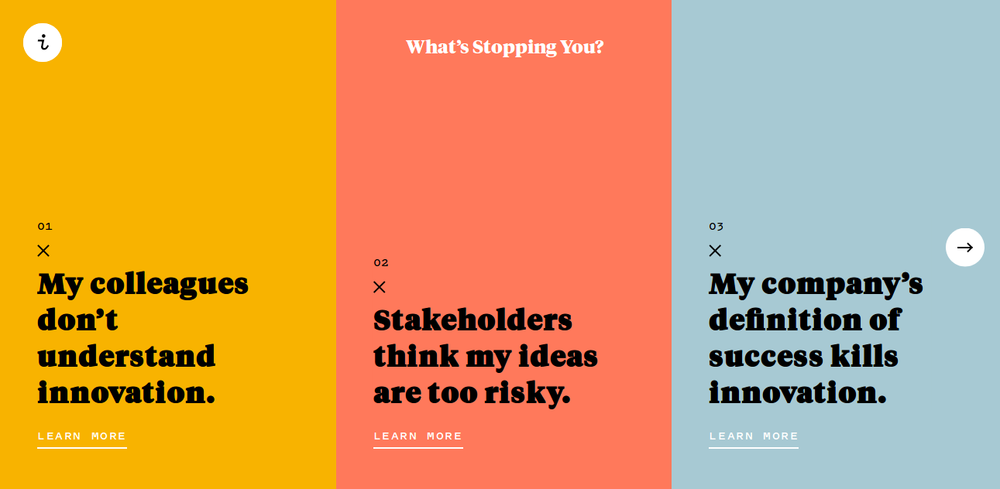

Settled on a main colour palette

I liked the way the swatches looked stacked on each other and thought I would try out a "post-it-note" layout.
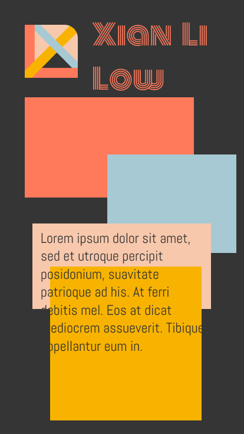
Ended up deciding against it because it was too flat.  

I've always admired city skylines and thought it would be fun to recreate "Melbourne". Came up with a few towers in Figma and decided to layer them to create a skyline. I then thought about using building signage as some form of a navbar, each link taking you to a page that focuses on the building the signage was on.

My wireframe results:
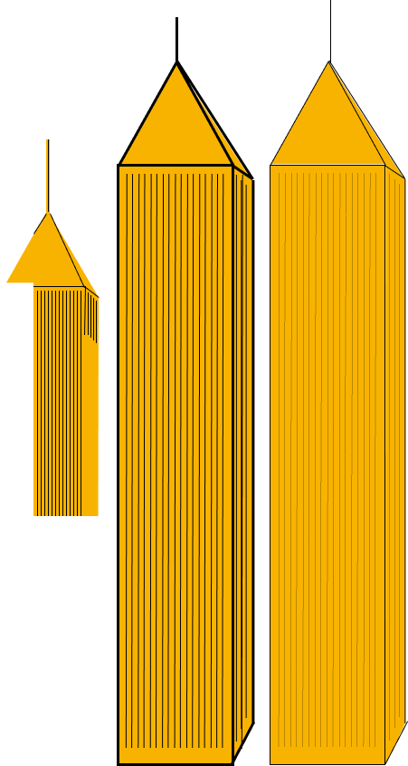
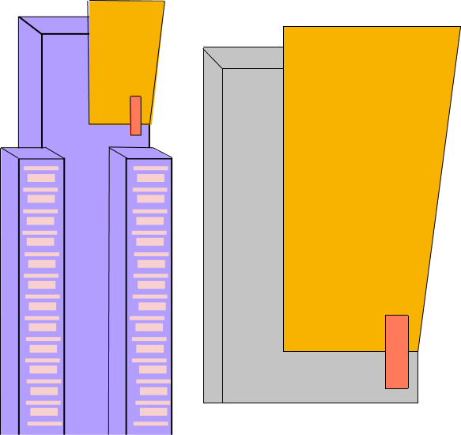
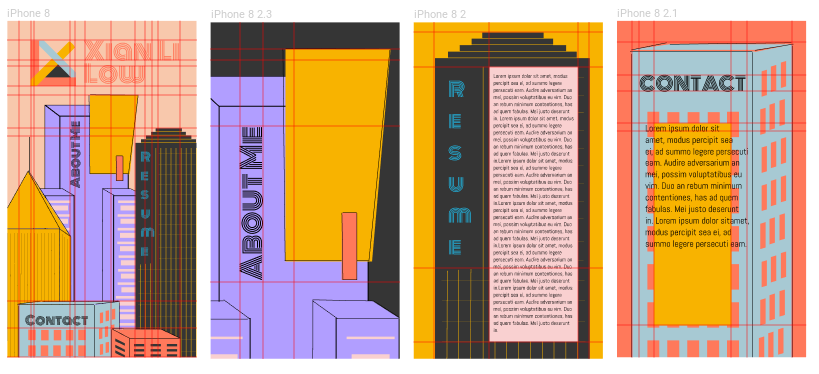

The "Monoton" font was chosen because it somewhat resembles neon light signage. The accompanying "Abel" font was picked because it looked simple and clean, a stark contrast, but they both have a sort of curvature to their characters so they're not totally removed from each other.

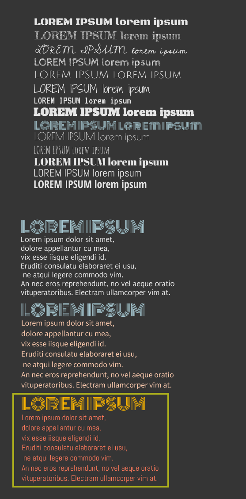

I also came up with a personal logo. It consists of the letters "X" and "L" made with the same colour palette as the website.

Another reason I veered away from the initial design was because the colour contrasts are only good between the yellow and dark grey, and the light pink and dark grey. So the colour palette is inconvenient for the post-it notes layout as I'd have to use font-background colour combinations that would be harder for users to read.

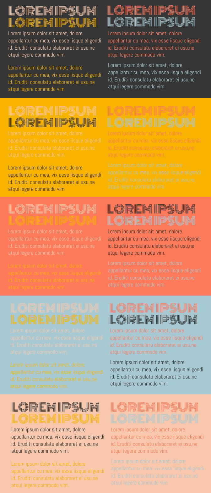

## Future Development
---
Given more time, I would have:
* made everything responsive. There is some responsiveness but not nearly enough. It breaks when you go to the mobile version. Needed more time to play with media queries.
* added a home button to the contact, about me and project pages to add navigational fuctionality. Currently utilising the back button in the browser to navigate.
* animated. I would have loved to have animated the signage on each building to light up and flicker as if they were real neon lights. I also wanted little silhouttes of birds and planes flying in the background. 
* overall polish. Dropshadows, content alignment etc.

# Short Answer Q&A
**_Describe key events in the development of the internet from the 1980s to today._**

80s'
* Dave Farber conceives the idea to build a network using dial-up phones lines whilst at the University of Delaware. 
* MILNET is split off from ARPANET to function as a military-only Internet.
* Tim Berners-Lee establishes HTML, HTTP  and builds the first Web browser. 
* The development of LANS, and the  use of PCs and workstations were widely adopted allowing the Internet to grow rapidly.

90s'
* Tim Berners-Lee launches the first web browser and web page. 
* The FNC passed a resolution defining the term Internet. 
* Microsoft's Windows 95 and IE, Amazon, Yahoo, eBay, Napster and Google are launched.
*  Java is introduced, animations on websites now a thing.

20s'
* Burst of the dotcom bubble.
* Friendster, MySpace, Facebook and Twitter are launched.
* Firefox, YouTube launches.
* Popularisation and adpotion of WiFi for mobile computing.
* Birth of the iPhone and ushers in the era of smartphones.

**_Define and describes the relationship between fundamental aspects of the internet such as: domains, web servers, DNS, and web browsers._**

A web browser is an application we use to access the Internet. An examples of this is Mozilla's Firefox. When we want to reach a specific site, we type in the domain name (eg: www.google.com) into our browser. Domain names are used so we can assign meaningful names to a host on the Internet as opposed to using a numerical address(IP addresses). They are registered in the DNS (domain name server) which store IP addresses. An IP address is unique to that computer/web server, so the computer can be found among all of the other devices connected to the internet.  When we type in a domain name into our browser, you are telling it to look for the IP address of that website. First in local DNS caches (if you have visited recently). Failing that, then in DNS servers which are usually provided to you by your Internet Service Provider (ISP). If another customer has accessed this website recently, you will find the IP address here and the information will be returned back to us and we can then request this IP address to load the website. 

**_Reflect on one aspect of the development of internet technologies and how it has contributed to the world today._**

The internet's greatest weapon is a double edged sword. The world has never before had this much easy access to this much information. The upside to this obvious; in only a few clicks or taps, anyone can access google, wikipedia or the news. You no longer have to leave your house, or pay through the nose in phone bills, to connect with loved ones from countries over. But with information traveling so fast, the integrity of the information published has taken a hit. Journalists have prioritised speed over accuracy in attempts to keep up with people live tweeting events. Everyone, including the misinformed, now have a platform in the form of social media to spread the misinformation and if it strikes an emotional chord with people, it will go viral. There seems to be a significant rise in distrust of the media as a result, and as people pick and choose their news sources, something akin to  propaganda is enabled. 